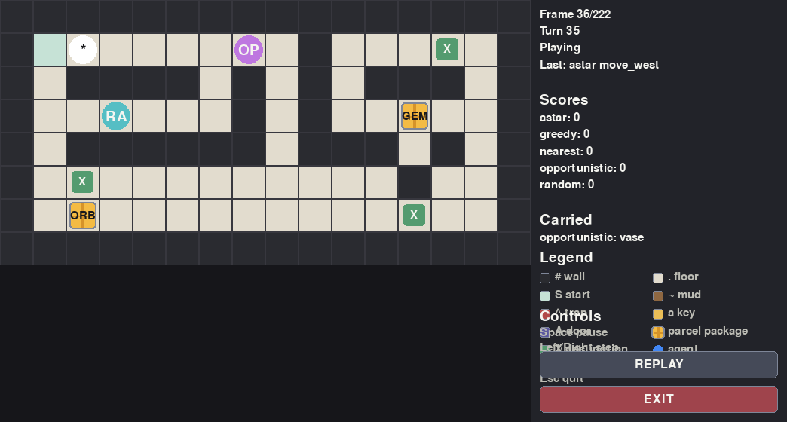

# Dungeon Delivery: A Search Tournament

Welcome to the Royal Dungeon Courier Service. Valuable magical artifacts must be delivered across a dungeon full of doors, keys, mud, traps, and competing couriers. Your agent is not paid by the hour; it is paid by successful deliveries.

## Overview

In this assignment, you will implement an agent that uses search to collect and deliver packages in a shared multi-agent tournament. Each agent is a magical courier on the same grid. Packages are shared resources: once one agent picks up a package, no other agent can take it. This creates a competitive twist while keeping the search problem approachable.

The assignment is designed to illustrate breadth-first search, uniform-cost search, greedy best-first ideas, A*, heuristics, replanning, and strategic target selection.

## Installation

```bash
pip install -e .
```

For tests, the optional dashboard, and the optional pygame replay viewer:

```bash
pip install -e ".[test,dashboard,visual]"
```

## Running a Tournament

```bash
python examples/run_tournament.py --rounds 100 --seed 0
```

You can also inspect one game:

```bash
python examples/demo_single_game.py
```

To watch completed games as pygame replays:

```bash
pip install -e ".[visual]"
python examples/replay_pygame.py --rounds 8 --fps 5
```

The pygame window first shows a round-selection menu. Click a game to replay it, then use SELECT GAME to return to the menu.

## Implementing an Agent

Start from `examples/student_agent_template.py`. Your agent should subclass `DungeonDeliveryAgent` and implement:

```python
def choose_action(self, observation: Observation) -> Action:
    ...
```

Your method is called only when your agent is not delayed by terrain. It should return one of `observation.legal_actions`.

To see what your bot is allowed to do on its current turn, inspect `observation.legal_actions`. This is a tuple of `Action` objects computed by the engine for the current position, collected keys, carried package, package availability, and key availability. For example:

```python
def choose_action(self, observation: Observation) -> Action:
    if ACTIONS["deliver"] in observation.legal_actions:
        return ACTIONS["deliver"]
    if ACTIONS["pick_up"] in observation.legal_actions:
        return ACTIONS["pick_up"]
    return observation.legal_actions[0]
```

If an agent returns an action that is not in `observation.legal_actions`, the engine treats it as `wait` and increments that agent's invalid-action count.

## Observation

The `Observation` object is a read-only view of the current game. It includes the visible grid, your position, your keys, your carried package, legal actions, available packages, available key positions, carried packages, delivered packages, all agent positions and scores, the current turn, max turns, terrain costs, and helper methods:

- `get_cell(position)`
- `get_cell_cost(position)`
- `is_passable(position, keys)`
- `neighbors(position, keys)`
- `estimate_path_cost(start, goal, keys)`

The `estimate_path_cost(start, goal, keys)` helper intentionally returns a simple Manhattan-distance estimate: `abs(start_row - goal_row) + abs(start_col - goal_col)`. It does not run BFS, uniform-cost search, or A*. It also ignores walls, terrain costs, doors, keys, packages, and other agents. The `keys` argument is accepted so the helper has the same shape as richer planning code, but this basic estimate does not use it.

This is deliberately a weak estimate. It is useful for quick target scoring and for simple heuristics, but students still need to implement real search if they want paths that account for weighted terrain, doors, and reachability.

Agents do not receive direct mutable game state, hidden random seeds, or private engine internals.

## Actions

Use the predefined actions:

- `ACTIONS["move_north"]`
- `ACTIONS["move_south"]`
- `ACTIONS["move_east"]`
- `ACTIONS["move_west"]`
- `ACTIONS["pick_up"]`
- `ACTIONS["deliver"]`
- `ACTIONS["wait"]`

The engine may record `wait_delayed` internally when terrain causes skipped turns. Student agents should not choose it.

## Map Tiles

The ASCII maps use these tile symbols:

- `#`: wall. Impassable.
- `.`: normal floor. Passable, cost 1.
- `S`: possible starting cell. Passable, cost 1.
- `~`: mud. Passable, cost 3, so entering it causes 2 future skipped turns.
- `^`: trap. Passable, cost 5, so entering it causes 4 future skipped turns.
- Lowercase letters such as `a`, `b`, `c`: available keys. Passable, cost 1. Moving onto a key cell adds that key to the agent's collected keys, then that key disappears and becomes ordinary floor for everyone else.
- Uppercase letters such as `A`, `B`, `C`: locked doors. A door is passable only if the agent has the matching lowercase key, for example key `a` opens door `A`. Entering a passable door costs 1.

Packages and destinations are not part of the ASCII map itself. They are stored separately in the map data. In text rendering and the pygame replay, available packages are drawn on top of the map, and destinations are shown as marked target cells. In the pygame replay, available packages are shown as yellow parcel icons labeled with the first few letters of the package id. Once an agent picks up a package, that package disappears from the board and appears in the side panel under `Carried` until it is delivered. Claimed keys also disappear from the visible board and are shown as ordinary floor in later observations and replay frames. Agents are drawn as overlays; they do not change the underlying tile.

Each agent can carry at most one package at a time. If an agent is already carrying a package, it cannot pick up another one until it delivers the current package.

## Agent Collision Rule

Multiple agents may occupy the same cell at the same time. Agents do not block movement and may pass through each other. The competitive part of the game comes from exclusive resources: once a package is picked up by one agent, it is no longer available to the others, and once a key is collected by one agent, that key disappears from the board.

If two or more agents are standing on the same package cell, the one whose turn comes first may pick it up. Other agents must observe that the package is gone and replan.

There are no simultaneous actions in the engine. At the beginning of each round, the tournament runner randomly shuffles the agent order once. The engine then cycles through that fixed order for the rest of the round. For example, if a round starts with the order `astar, greedy, nearest`, scheduled turns proceed as `astar, greedy, nearest, astar, greedy, nearest, ...`.

This fixed per-round order is also the tie-breaker for contested pickups and key collection. If two agents both intend to pick up the same package, the earlier scheduled agent gets it first, the package becomes unavailable immediately, and a later `pick_up` for that same package is invalid and is treated as `wait`. If two agents are racing for the same key, the earlier scheduled agent who moves onto the key cell collects it; later agents see ordinary floor there and do not receive the key.

## Terrain Costs

The movement cost of a cell is the cost of entering that cell. Entering mud costs 3, so the agent moves into the mud cell immediately and then skips its next 2 scheduled turns. Entering a trap costs 5, so the agent skips its next 4 scheduled turns. Therefore, good agents should minimize total movement cost, not just the number of moves.

The start cell, normal floor, keys, and passable doors cost 1. Mud costs 3. Traps cost 5. Pickup, delivery, and waiting each consume one scheduled turn.

## Doors and Keys

Uppercase letters are locked doors. Door `A` requires key `a`. Keys are exclusive: moving onto an available key cell gives that key to the agent and removes that key from the board. Other agents can still move through the cell afterward, but they do not receive the key from that cell. If a map has another copy of the same lowercase key somewhere else, that separate key cell can still be collected.

## Search Guidance

BFS is suitable only when all movement costs are equal. Uniform-cost search handles weighted terrain. A* can be faster if the heuristic is informative. The provided A* baseline uses Manhattan distance times the minimum terrain cost, which is admissible for ordinary grid movement in these maps.

Replanning is important because other agents can take packages before you reach them. Greedy target selection can be improved using value/distance ratios, estimated delivery cost, and whether another agent appears likely to reach a package first.

Other agents should not be treated as impassable obstacles in the default rules. They can stand together, pass through each other, and share cells freely.

For simple pathfinding to a fixed target, a search state can be just `position`. For planning with doors and keys, a state might be `(position, frozenset(keys))`. If your strategy reasons about whether a key will still be available, the state may also need available key positions. For full package pickup and delivery planning, a state might include `(position, frozenset(keys), carried_package, delivered_packages)`. The baseline agents replan greedily each turn instead of searching the full delivery problem.

## Baseline Agents

- `RandomAgent`: chooses a random legal action.
- `NearestPackageAgent`: uses BFS-like shortest paths by number of steps and ignores terrain costs.
- `GreedyValueAgent`: chooses packages using value divided by estimated distance.
- `AStarBaselineAgent`: uses A* with movement costs and chooses packages by estimated pickup plus delivery cost.
- `OpportunisticAgent`: picks up and delivers immediately when possible, otherwise uses value/cost with a penalty for packages that competitors seem closer to.

## Replay Visualization

The engine records lightweight snapshots for every scheduled turn. This allows hindsight visualization without changing the headless tournament engine used for grading. After a tournament finishes, students can open a pygame replay window, choose which round to inspect, and watch the agents move through the dungeon one scheduled turn at a time. This is useful for debugging search behavior: students can see when an agent chooses a muddy shortcut, gets delayed by terrain, loses a package race because another agent picked it up first, claims a key before another agent can use it, passes through a locked door, or replans after a package or key disappears.



Use `dungeon_delivery.pygame_viewer.replay_result(result)` to open an animated pygame window for one completed `GameResult`, or `replay_tournament(tournament_result)` to choose among many rounds inside the pygame window. The viewer shows the map terrain, walls, available keys, doors, agents, available packages as yellow parcel icons, package destinations, carried packages, scores, current frame, current turn, the last action taken, and an in-window legend explaining the tile colors and overlays. When a key is collected, it disappears from later replay frames and the cell is drawn as floor. Press Space to pause, Left/Right to step, R or REPLAY to restart, SELECT GAME to return to the menu, and Esc or EXIT to quit.

```python
from dungeon_delivery.pygame_viewer import replay_result, replay_tournament

result = game.run()
replay_result(result, fps=5)

tournament_result = run_tournament(agents, rounds=8, seed=0)
replay_tournament(tournament_result, fps=5)
```

## Tournament Scoring

The submitted agents will be evaluated in a shared tournament against baselines and against other submitted agents.

If the best submitted score is B:

- score >= 0.9 * B: 5 points
- score >= 0.8 * B: 4 points
- score < 0.8 * B: 3 points

Additionally, students will be asked 3 questions about their code. Each incorrect answer gives -1 point.

## Suggested Steps

- Start from the provided baseline agents.
- Implement a shortest-path search.
- Compare BFS, UCS, and A*.
- Add terrain costs.
- Add support for doors and keys.
- Choose packages using value and estimated delivery cost.
- Optionally account for whether another agent is likely to pick up a target package first.
- Replan every turn.
- Test in the tournament dashboard.
